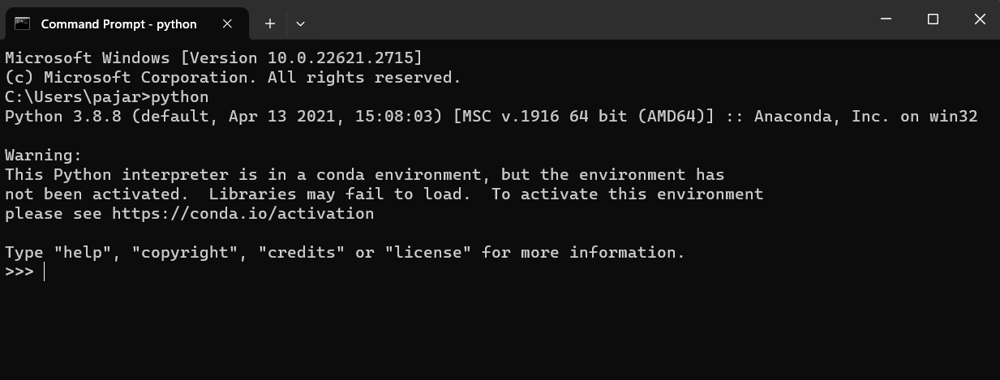
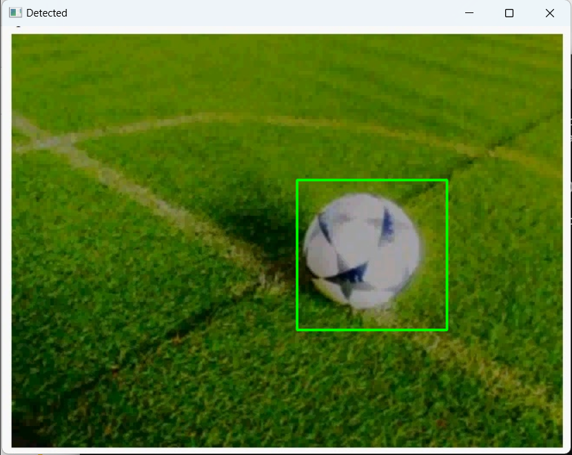

### Requirement :
- Python >= 3
- Numpy
- Opencv >= 3
  

### How to install?
1. Pastikan sudah menginstall `python` pada komputer masing - masing.

2. Python dapat diperiksa dengan menjalankan perintah `python` pada command prompt (cmd).

3. Jika tidak terdapat error, maka python interpreter sudah terinstal.

4. Jika python belum terinstal, maka ikuti langkah no 5. Jika sudah, maka dapat skip ke langkah no 7.

5. Bagi komputer yang belum terinstal python, download python pada laman resminya `https://www.python.org/downloads/` atau dapat menggunakan anaconda.

6. Setelah terinstal, setup python pada environment variable dengan langkah berikut: 
    -  Ketik `python.exe` pada start menu dan pilih `open file location`
     
    
      

    - Maka anda akan diarahkan ke folder tempat python terinstal.
     
    
      

    - Setelah itu kembali ke start menu dan ketik environment variable dan pilih Edit System Environment seperti pada gambar berikut:
     
    
      

    - Kemudian akan muncul popup seperti berikut. Click kotak berwarna merah.
     
    
      

    - Selanjutkan akan muncul popup lagi seperti berikut. Pilih `Path` dan click `Edit`.
     
    
      

    - Jika muncul popup yang berisi daftar path environment variable yang ada pada komputer, maka abaikan dulu. Kita kembali ke folder pada tempat python terinstal.

    - Copy path folder tersebut.
     
    
      

    - Kembali pada popup daftar path environment variable. Klik `new` dan paste path folder python pada baris paling bawah.
     
    
      

    - Kembali ke folder python terinstal. Cari folder dengan nama `Scripts` kemudian copy path folder tersebut dan paste ke popup daftar path environment variable (lakukan seperti langkah sebelumnya).
     
    
      

7. Jika langkah sebelumnya sudah dilakukan dan tidak terdapat error, maka `python` sudah berhasil terinstal pada komputer anda. Anda dapat memastikannya dengan membuka command prompt kemudian ketik `python`. Seharusnya akan tampil seperti berikut:
 

  

8. Copy citra yang akan dideteksi ke folder `datatest` dan model yang sudah dilatih ke folder `models`.
 

  

9. Buka cmd dan arahkan ke folder project ini. Anda dapat langsung membuka cmd pada folder root dengan cara klik address bar, ketik cmd, dan tekan enter.
 

  

10. Setelah cmd terbuka pada folder project, install semua package (library) yang dibutuhkan dengan cara ketik `pip install -r requirements.txt`. Maka python akan menginstall semua library yang dibutuhkan.
 

  

11. Jika semua library sudah terinstal dan tidak terdapat error, anda dapat menjalankan program dengan perintah `python nama_program.py` atau `python image.py`. Pastikan anda telah membukan program dan mengganti nama citra serta model yang akan digunakan.

12. Program akan menampilkan hasil deteksi sebagai berikut.
 
